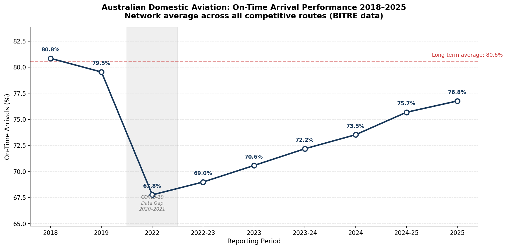
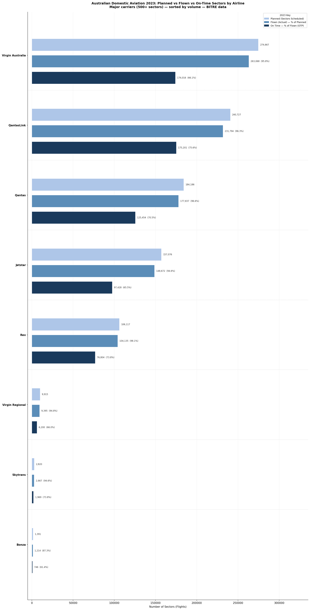
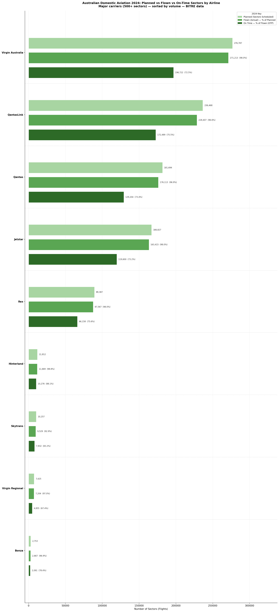
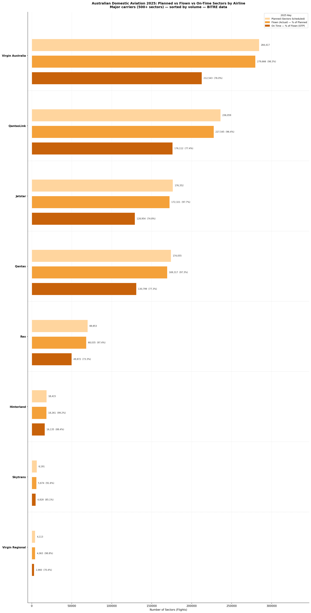
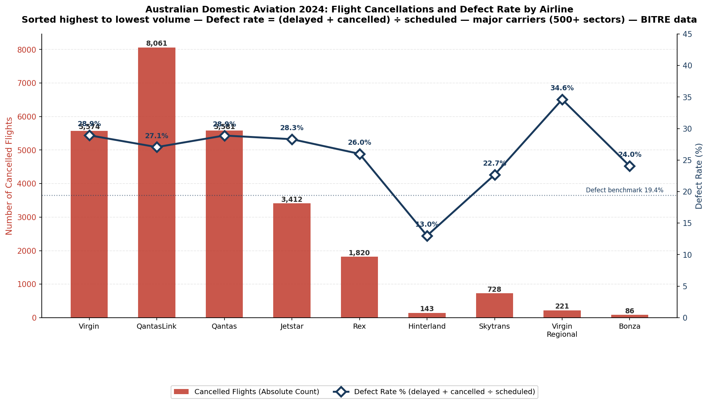
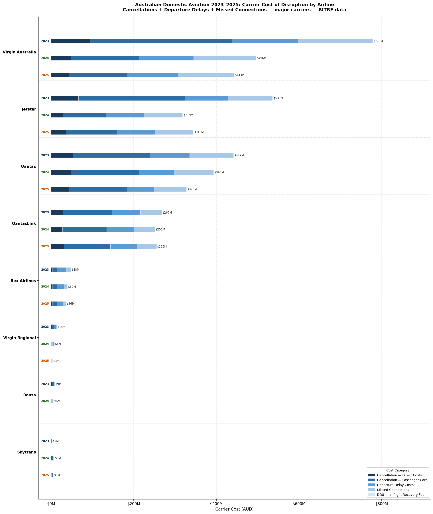
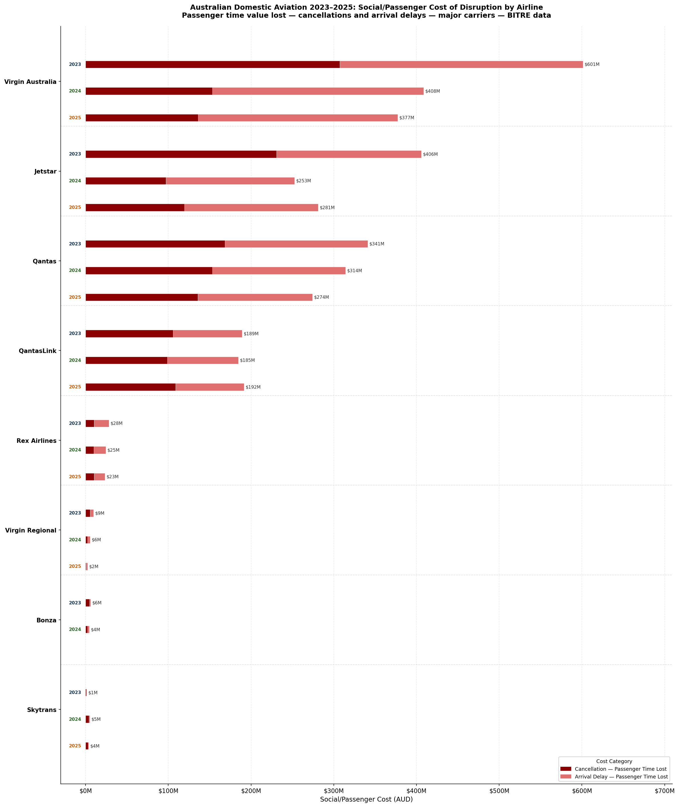
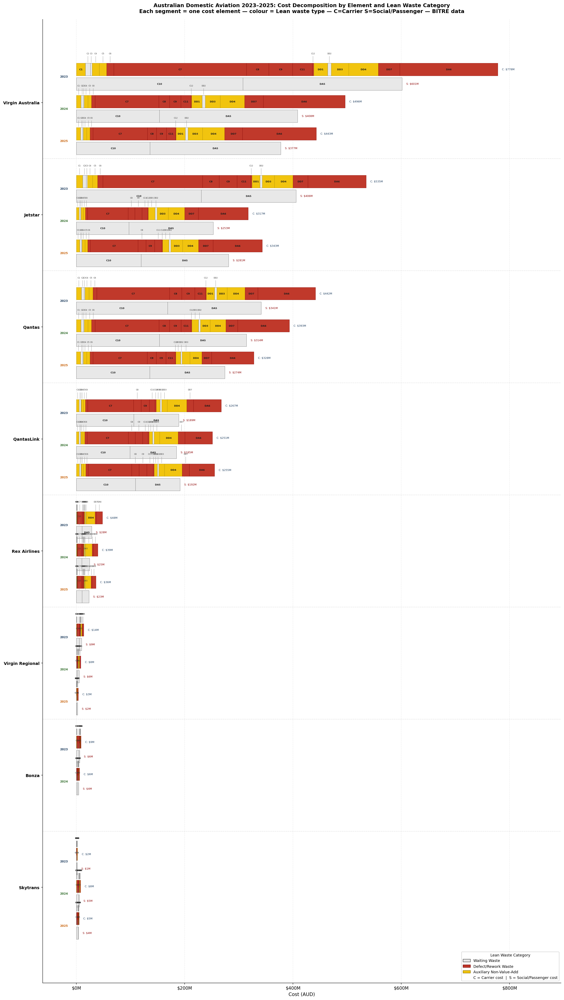

# The Economic Cost of Australian Domestic Flight Delays and Cancellations
### A Lean Thinking Diagnostic of Australian Domestic Aviation 2023–2025

**Author:** Erick Mortera — Certified Lean Manufacturing Trainer | Industrial Engineer  
**Tools:** Python · PostgreSQL · BITRE Public Data · EUROCONTROL Cost Framework  
**Status:** Analysis complete — conference paper in preparation (ATRF 2026)

---

## The Problem in One Sentence

Between 2023 and 2025, Australian domestic airlines cancelled 88,316 flights
and delayed 741,217 arrivals — costing the aviation system an average of
**AUD $2.99 billion per year** in carrier operating waste and passenger economic loss.

Nobody had translated these numbers into dollars using Australian public data.
This study does that for the first time.

---

## Why Lean Thinking?

Most aviation disruption studies ask: *how often do flights fail?*

This study asks: *where in the value stream does the waste occur, who bears
the cost, and what is the most cost-effective intervention to eliminate it?*

| Lean Principle | Aviation Application |
|---|---|
| **Define Value** | A passenger arrives at their destination on time, as scheduled |
| **Map the Value Stream** | Every step from rotation planning to gate arrival |
| **Create Flow** | Flights should flow without interruption — delays are flow stoppages |
| **Establish Pull** | Schedule only what the network can reliably deliver |
| **Pursue Perfection** | The industry's own benchmark: 80.6% OTP |

---

## Data Sources

All primary data is Australian public domain:

| Source | What It Provides | Period |
|---|---|---|
| [BITRE OTP Statistics](https://www.bitre.gov.au/statistics/aviation) | Cancellations, delays, OTP by airline and route | 2018-2025 |
| [BITRE Activity Time Series](https://www.bitre.gov.au/publications/ongoing/domestic_airline_activity-time_series) | Passengers, seats, load factors | 2014-2026 |
| [ABS Average Weekly Earnings](https://www.abs.gov.au/statistics/labour/earnings-and-working-conditions/average-weekly-earnings-australia/latest-release) | Passenger time value proxy | 2023-2025 |
| [ACCC Airline Competition Reports](https://www.accc.gov.au/by-industry/aviation/domestic-airline-monitoring) | ATC attribution, route analysis | 2023-2025 |
| [Qantas Annual Reports](https://investor.qantas.com) | Financial triangulation | FY2023-2025 |
| [Virgin Australia Financials](https://www.virginaustralia.com/au/en/about-us/investor-centre/) | Financial triangulation | FY2024-2025 |

Cost methodology: [EUROCONTROL Standard Inputs Edition 10.0](https://ansperformance.eu/economics/cba/standard-inputs/)

---

## The Cost Model

### 21 Cost Elements Across Three Lean Waste Categories

**Cancellation Elements (C1-C12)** — triggered when a scheduled flight never operates  
**Departure Delay Elements (DD1-DD8)** — uses departures_delayed count, carrier costs only  
**Arrival Delay Elements (DA5-DA6)** — uses arrivals_delayed count, social costs only

| Lean Category | Colour | Elements | Description |
|---|---|---|---|
| **Waiting** | Grey | C2, C3, C10, DD2, DA5 | Time consumed with zero productive output |
| **Defect/Rework** | Red | C6-C9, C11, C12, DD7, DA6 | Recovery activities triggered by failure |
| **Auxiliary NVA** | Yellow | C1, C4, C5, DD1, DD3, DD4, DD8 | Work consumed without value delivery |

### Key Innovation — DD8 Recovery Fuel Premium

Jetstar and Virgin Regional consistently show more departure delays than arrival
delays — recovering ground failures by flying faster at hidden fuel cost:

- **Jetstar 2024:** 3,474 recovery sectors x AUD $491/sector = **AUD $1.67 million annually**

---

## Headline Findings

| Year | Carrier Cost | Social Cost | Grand Total |
|---|---|---|---|
| 2023 | AUD $2.096B | AUD $1.583B | **AUD $3.679B** |
| 2024 | AUD $1.521B | AUD $1.200B | **AUD $2.721B** |
| 2025 | AUD $1.417B | AUD $1.154B | **AUD $2.571B** |
| **3-Year Average** | **AUD $1.678B** | **AUD $1.312B** | **AUD $2.990B** |

### Airline Performance 2024 — Normalised by Volume

| Airline | Total Waste | Defect Rate | Waste Per Sector |
|---|---|---|---|
| Virgin Australia | AUD $905M | 26.9% | AUD $3,337 |
| Qantas | AUD $707M | 26.6% | AUD $4,015 |
| Jetstar | AUD $572M | 27.9% | AUD $3,500 |
| QantasLink | AUD $436M | 24.5% | AUD $1,909 |
| Rex Airlines | AUD $64M | 24.5% | AUD $731 |

*Qantas records the highest waste cost per flight operated —
scale alone does not explain the cost differential.*

### Uplift Potential — If All Carriers Hit 80.6% OTP Benchmark

| Year | Excess Defect Events | Potential Saving |
|---|---|---|
| 2023 | 129,562 | AUD $1.002B |
| 2024 | 84,057 | AUD $0.650B |
| 2025 | 60,592 | AUD $0.469B |
| **3-Year Total** | **274,211** | **AUD $2.121B** |

---

## Charts

### Chart 1 — Industry OTP Trend 2018-2025


### Charts 2A/2B/2C — Airline Performance by Year




### Chart 3 — Defect Rate by Airline


### Chart 6A — Carrier Cost of Disruption


### Chart 6B — Social/Passenger Cost of Disruption


### Chart 7 — Cost Decomposition by Lean Waste Category


---

## Structural Findings

**QantasLink — The Persistent Problem**  
Cancellations: 8,933 (2023) — 8,061 (2024) — 8,514 (2025).  
Every other major carrier improved. QantasLink did not.  
Diagnosis: scheduling buffer deficiency in rotation planning.

**Jetstar — Hidden Ground Process Failure**  
Largest negative net enroute delay differential (−3,474 in 2024).  
Departure delays systematically recovered by higher cruise speed.  
Cost: AUD $1.67M additional fuel annually — masking not fixing the defect.

**The Policy Gap**  
Australia is the only major aviation market without mandatory passenger
compensation. Passengers bear AUD $1.31B annually with no legal protection.

---

## Three Lean Recommendations

### 1 — Standard Work for Aircraft Turnaround
**Target:** Jetstar, Virgin Australia Regional  
**Lean Tools:** Standard Work, Takt Time, Visual Management  
**Estimated Saving:** AUD $115M annually  

Define standard turnaround sequence with takt time for each activity.
Implement visual management at the gate. Apply root cause analysis to
every turnaround exceeding standard time.

### 2 — Dynamic Rotation Buffering
**Target:** QantasLink  
**Lean Tools:** Heijunka, Protective Capacity, Bottleneck Analysis  
**Estimated Saving:** AUD $140M over three years  

Apply dynamic buffering to high-risk slot sequences at Sydney (YSSY)
and Melbourne (YMML). First and last rotations of the day generate
disproportionate cascading cancellations — apply 25-minute buffer to
these, 10-minute buffer midday. This is Heijunka applied to aviation
scheduling: level the load at points of highest variability.

### 3 — Voluntary Passenger Compensation Policy
**Target:** Airline Operations and Customer Experience Leadership  
**Basis:** AUD $1.31B annual uncompensated passenger cost  

Develop and publish a voluntary disruption compensation policy ahead
of inevitable legislation. The airline that moves first achieves
competitive differentiation and a stronger regulatory negotiating position.

---

## Model Validation

| Validation Layer | Finding | Result |
|---|---|---|
| Internal consistency | Qantas waste = 3.78% of total operating cost | EUROCONTROL benchmark 1-4% ✅ |
| External benchmark | Low scenario vs AirHelp aviation-direct estimate | Within 2% after scope adjustment ✅ |
| Trend validation | Waste reduction 2023-2025 | Consistent with ACCC/BITRE reporting ✅ |

---

## Database Architecture

A PostgreSQL relational cost database underpins all analysis.
10 tables, 21 cost elements, 1,512 cost rate rows across three scenarios.

| Table | Rows | Purpose |
|---|---|---|
| aircraft_types | 8 | Physical specs, fuel burn |
| airline_fleet | 26 | Airline-aircraft mapping by year |
| cost_elements | 21 | C1-C12, DD1-DD8, DA5-DA6 with Lean categories |
| cost_rates | 1,512 | Dollar values per element per scenario |
| otp_events | 4,837 | Full BITRE OTP master data |
| passenger_time_value | 9 | ABS AWE by year and travel purpose |
| delay_causes | 15 | EUROCONTROL cause proportions + Lean mapping |
| airline_financials | 5 | Qantas + Virgin annual reports |

---

## Methodology and Key Assumptions

### Currency Conversion
Cost rates from EUROCONTROL Table 12.1 are published in USD 2022 prices.
Converted to AUD using RBA annual average exchange rates and 4% CPI
escalation per year from the 2022 base (ABS Cat 6401.0).

| Year | CPI Factor | RBA AUD/USD | USD 2022 → AUD |
|---|---|---|---|
| 2023 | 1.040 | 0.664 | 1.566 |
| 2024 | 1.082 | 0.653 | 1.657 |
| 2025 | 1.125 | 0.632 | 1.780 |

*Sources: RBA Statistical Table F11 — Annual Average AUD/USD;
ABS Consumer Price Index Cat 6401.0*

### Key Assumptions

| Assumption | Value | Basis |
|---|---|---|
| Load factor | 81% | BITRE domestic average 2023-2025 |
| Base delay duration | 30 minutes | Truncated log-normal distribution — BITRE 15-min threshold |
| Cancellation wait time | 2/4/8 hrs (low/base/high) | ACCC load factor data + US DOT 3-hr industry standard |
| Connection rate | 8% | BITRE: 17.7% prevalence x 45% miss probability |
| Spillover effects | Excluded | Deliberate boundary — direct aviation costs only |
| DD8 fuel increase | 10% | Boeing 737 performance data |
| USD to AUD conversion | Year-specific | RBA annual average + 4% CPI from 2022 base |

### Sensitivity Analysis
All three scenarios (low/base/high) tested across delay duration,
cancellation wait time, and cost rates. Full sensitivity results
in Cell 20c of the notebook.

| Year | Low Scenario | Base Scenario | High Scenario |
|---|---|---|---|
| 2023 | AUD $1.89B | AUD $3.68B | AUD $7.21B |
| 2024 | AUD $1.45B | AUD $2.72B | AUD $5.36B |
| 2025 | AUD $1.40B | AUD $2.57B | AUD $5.09B |

### Delay Duration Basis
BITRE classifies a flight as delayed when it arrives at the gate
15+ minutes after scheduled time. Minimum possible delay in our
dataset is therefore 16 minutes. Using a truncated log-normal
distribution calibrated to Australian domestic OTP data, the
expected delay duration among classified-delayed flights is
approximately 28-32 minutes. US cross-validation (BTS data:
55 min average x 0.65 sector length scaling) gives 36 minutes.
Base case of 30 minutes is conservative and consistent with
both methods.

### Cancellation Wait Time Basis
Base case of 4 hours derived from three sources:
ACCC December 2025 report confirms high load factors extend
rebooking wait times; US DOT industry standard triggers
passenger care at 3+ hours; BITRE load factor of 81.5% in 2024
means approximately 4-5 subsequent departures needed to absorb
all displaced passengers on trunk routes.

---

## Repository Structure

```
01-aviation-flight-delay-cost/
├── aviation_delay_cost_analysis.ipynb
├── README.md
├── data/
│   ├── raw/                    (source files — not committed)
│   └── processed/
│       ├── otp_master_clean.csv
│       └── cost_model_results.csv
└── charts/
```

---

## Citation

> Mortera, E. (2026). *The Economic Cost of Australian Domestic Flight
> Delays and Cancellations: A Lean Thinking Diagnostic of Australian
> Domestic Aviation 2023-2025*. GitHub repository.
> https://github.com/erick-m-lean-analytics/Transport-Operations-Analysis

---

## Contact
---

## Licence

This project uses a dual licence:

- **Code** (Python, SQL, Jupyter notebook): [MIT Licence](LICENSE)
- **Analysis, findings, charts, and written content**: [Creative Commons Attribution 4.0 International (CC BY 4.0)](https://creativecommons.org/licenses/by/4.0/)

Under CC BY 4.0 you are free to share and adapt this work for any purpose,
provided you give appropriate credit to the author.

---

## Citation

> Mortera, E. (2025). *The Economic Cost of Australian Domestic Flight
> Delays and Cancellations: A Lean Thinking Diagnostic of Australian
> Domestic Aviation 2023-2025*. GitHub repository.
> https://github.com/erick-m-lean-analytics/Transport-Operations-Analysis/tree/main/01-aviation-flight-delay-cost

---

## AI Assistance Disclosure

Python code for data processing and visualisation was developed with
assistance from Claude (Anthropic), an AI language model. All analytical
decisions, cost framework design, assumptions, and interpretations are
the author's own.

The intellectual contributions that are unambiguously the author's:
the research questions, the DD/DA cost split architecture, the DD8
recovery fuel finding, the Lean waste mapping, the three recommendations,
and all domain judgements.

---

## Contact