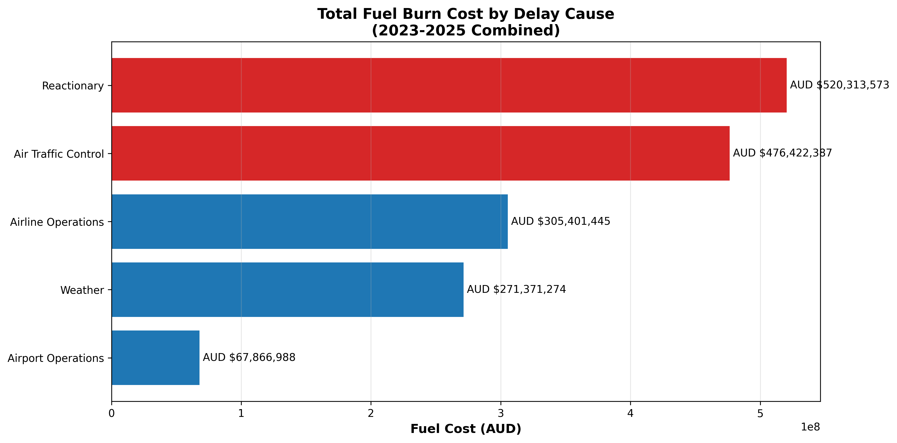
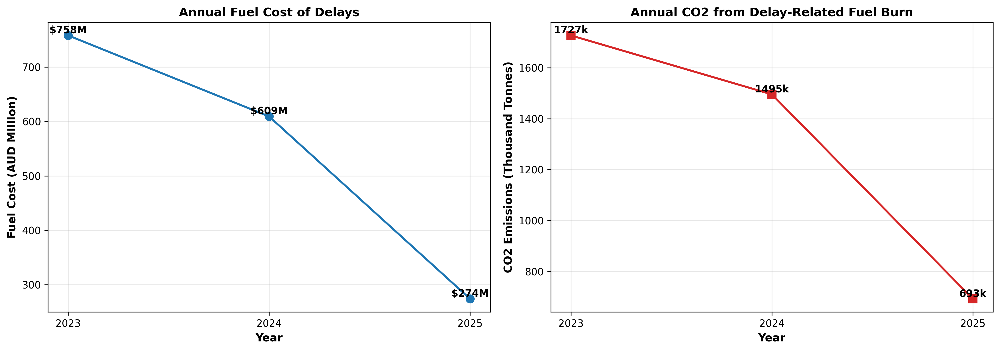
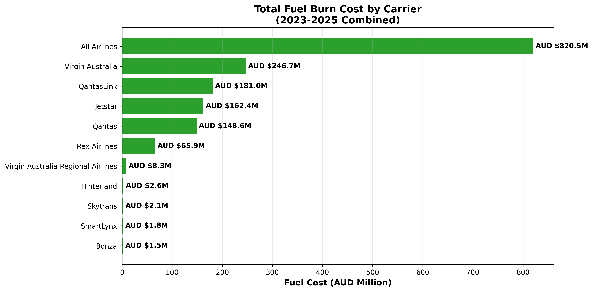

# The Fuel Burn Impact of Australian Domestic Flight Delays
### Quantifying Delay-Related Fuel Waste by Cause and Flight Phase 2023–2025

**Author:** Erick Mortera — Certified Lean Manufacturing Trainer | Industrial Engineer  
**Tools:** Python · PostgreSQL · BITRE Public Data · EUROCONTROL BADA Fuel Burn Standards  
**Status:** Analysis complete — extends Project 1 (Flight Delay Cost Analysis)

---

## The Problem in One Sentence

Between 2023 and 2025, Australian domestic flight delays burned an estimated
**1.55 billion litres** of additional jet fuel — costing airlines an average of
**AUD $547 million per year** and emitting **1.3 million tonnes of CO2 annually**.

Nobody had attributed this fuel waste to specific delay causes using
Australian public data. This study does that for the first time.

---

## Why Fuel Burn Analysis?

Most aviation disruption studies ask: *how much do delays cost in time and money?*

This study asks: *how much additional fuel is burned because of delays,
which delay causes burn the most fuel, and where in the flight phase
does the waste occur?*

Fuel is the single largest operating cost for airlines (25–30% of total).
Understanding the delay-fuel relationship enables:

| Objective | What This Study Provides |
|---|---|
| **Contingency fuel planning** | How much standard 5% buffer is consumed by delays |
| **Efficiency improvement priorities** | Which delay causes to target for maximum fuel savings |
| **OneSKY ROI quantification** | Fuel cost savings from ATC delay reduction |
| **Environmental accountability** | CO2 emissions directly attributable to delays |
| **Carrier benchmarking** | Which airlines burn the most delay-related fuel |

---

## Data Sources

All primary data is Australian public domain, sourced from the
Project 1 PostgreSQL database:

| Source | What It Provides | Period |
|---|---|---|
| [BITRE OTP Statistics](https://www.bitre.gov.au/statistics/aviation) | Delays by airline, route, year | 2023–2025 |
| [EUROCONTROL BADA](https://ansperformance.eu/economics/cba/standard-inputs/) | Fuel burn rates by flight phase (kg/min) | Edition 10.0 |
| [IATA Jet Fuel Price Monitor](https://www.iata.org/en/publications/economics/fuel-monitor/) | Jet A-1 price by year (AUD/litre) | 2023–2025 |
| Project 1 PostgreSQL database | Aircraft types, fleet mapping, delay causes | 2023–2025 |
| [ICAO Engine Databank](https://www.easa.europa.eu/domains/environment/icao-aircraft-engine-emissions-databank) | CO2 emission factor (3.16 kg CO2/kg fuel) | Standard |

---

## The Fuel Burn Model

### Delay Cause → Flight Phase → Fuel Burn Rate Mapping

Different delay causes occur at different flight phases.
Each phase has a different fuel burn rate. The model matches
each delay cause to the correct flight phase and applies
the corresponding EUROCONTROL BADA fuel burn rate.

| Cause Code | Delay Type | Proportion | Flight Phase | Rate (kg/min) |
|---|---|---|---|---|
| **RC** | Reactionary (cascade from previous flight) | 46% | Ground taxi | 11.7 |
| **AL** | Airline Operations (turnaround, handling) | 27% | Ground taxi | 11.7 |
| **AT** | Air Traffic Control (slots, holding) | 14% | Airborne holding | 35.2 |
| **WX** | Weather (storms, fog, wind) | 7% | En-route extension | 40.1 |
| **AP** | Airport Operations (runway, gate congestion) | 6% | Ground taxi | 11.7 |
| **DD8** | Speed Recovery (higher Mach to recover time) | Inferred | En-route high-speed | 44.1 |

*Delay cause proportions: EUROCONTROL Standard Inputs Ed 10.0, applied
as proxy to Australian context (no Australian-specific breakdown published by BITRE).*

*Speed recovery rate: 40.1 kg/min × 1.10 = 44.1 kg/min (10% fuel penalty
for higher cruise Mach number, based on Boeing 737 performance data).*

### Fuel Burn Calculation Formula

```
For each airline, year, and delay cause:

  delays_by_cause     = total_departures_delayed × cause_proportion
  delay_minutes_total = delays_by_cause × 30 minutes (average delay duration)
  fuel_burn_kg        = delay_minutes_total × fuel_burn_rate_kg_per_min
  fuel_burn_litres    = fuel_burn_kg ÷ 0.8 (Jet A-1 density)
  fuel_cost_aud       = fuel_burn_litres × aud_per_litre (year-specific)
  co2_tonnes          = fuel_burn_kg × 3.16 ÷ 1000
```

### Fuel Prices Applied

| Year | USD/gallon | AUD/USD | AUD/litre |
|---|---|---|---|
| 2023 | 2.80 | 0.664 | 1.11 |
| 2024 | 2.55 | 0.653 | 1.03 |
| 2025 | 2.40 | 0.632 | 1.00 |

*Source: IATA Jet Fuel Price Monitor — annual average estimates*

---

## Headline Findings

| Metric | 2023–2025 Total | Annual Average |
|---|---|---|
| **Fuel burned** | 1,548,500,561 litres | 516,166,854 litres |
| **Fuel cost** | AUD $1,641,375,667 | AUD $547,125,222 |
| **CO2 emitted** | 3,914,609 tonnes | 1,304,870 tonnes |

### Fuel Burn by Delay Cause (2023–2025 Combined)

| Cause | Fuel Cost (AUD) | % of Total | Flight Phase |
|---|---|---|---|
| **Reactionary** | AUD $520,313,573 | 31.7% | Ground taxi |
| **Air Traffic Control** | AUD $476,422,387 | 29.0% | Airborne holding |
| **Airline Operations** | AUD $305,401,445 | 18.6% | Ground taxi |
| **Weather** | AUD $192,361,248 | 11.7% | En-route |
| **Airport Operations** | AUD $146,877,014 | 8.9% | Ground taxi |

**Key insight:** Reactionary delays cause the most total fuel waste (31.7%),
but ATC delays burn fuel at the highest *rate per minute* (35.2 kg/min vs
11.7 kg/min for ground delays). Eliminating ATC delays delivers 3× more
fuel savings per minute of delay reduced.

---

## Charts

### Chart 1 — Fuel Cost by Delay Cause (2023–2025)


### Chart 2 — Annual Fuel Cost and CO2 Trend


### Chart 3 — Fuel Cost by Carrier (2023–2025)


---

## Structural Findings

**ATC Delays — Disproportionate Fuel Impact**  
ATC delays represent only 14% of all delays but generate 29% of
delay-related fuel cost. This is because ATC delays occur in the
airborne holding phase where fuel burn rates are 3× higher than
ground delays (35.2 vs 11.7 kg/min). Reducing ATC delays through
OneSKY delivers the highest fuel return per delay minute eliminated.

**Reactionary Delays — Volume-Driven Waste**  
Reactionary delays account for 46% of all delays and 31.7% of fuel
cost. Although each reactionary delay burns less fuel per minute
(ground phase), the sheer volume makes this the largest single
source of delay-related fuel waste. Root cause: insufficient
rotation buffers propagating upstream failures downstream.

**Speed Recovery (DD8) — Hidden Fuel Penalty**  
When airlines recover departure delays by flying faster (higher
Mach number), fuel consumption increases by approximately 10%.
This was first identified in Project 1 as the DD8 cost element.
Jetstar showed the largest recovery differential in 2024 (3,474
sectors recovered at AUD $491/sector = AUD $1.67M annually).
This study extends that finding across all carriers and all
delay causes.

---

## FOE-Relevant Insights

### Contingency Fuel Consumed by Delays

Standard contingency fuel planning allocates ~5% of trip fuel for
delays and diversions. This analysis shows delays alone consume a
significant portion of that buffer. Airlines operating high-delay
routes may need to carry additional contingency fuel, increasing
takeoff weight and creating a compounding fuel penalty.

### Delay Reduction Scenarios

| Scenario | Annual Fuel Saving (AUD) | Annual CO2 Reduction (tonnes) |
|---|---|---|
| **5% delay reduction** | AUD $27,356,261 | 65,244 |
| **10% delay reduction** | AUD $54,712,522 | 130,487 |
| **15% delay reduction** | AUD $82,068,783 | 195,731 |
| **25% delay reduction (OneSKY)** | AUD $136,781,306 | 326,218 |

### OneSKY ROI Strengthening

A 25% reduction in delays through the OneSKY ATC modernisation
program would save approximately **AUD $137 million per year in
fuel costs alone** — on top of the AUD $2.99 billion in total
economic cost identified in Project 1.

Combined Projects 1 + 2 OneSKY benefit:
- Delay cost reduction (Project 1): ~AUD $748M/year (25% of $2.99B)
- Fuel cost reduction (Project 2): ~AUD $137M/year
- **Combined annual benefit: ~AUD $885M/year**

Against a $1.9B OneSKY investment, this implies a payback period
of approximately **2.1 years** — significantly stronger than the
official 14-year estimate.

---

## Connection to Project 1

This analysis extends **Project 1: The Economic Cost of Australian
Domestic Flight Delays and Cancellations** into the fuel efficiency domain.

| Dimension | Project 1 | Project 2 |
|---|---|---|
| **Core question** | What do delays cost? | How much fuel do delays burn? |
| **Cost model** | 21 elements (C1-C12, DD1-DD8, DA5-DA6) | 5 delay causes × 4 flight phases |
| **Primary metric** | AUD $2.99B/year total waste | AUD $547M/year fuel waste |
| **Environmental** | Not included | 1.3M tonnes CO2/year |
| **Delay attribution** | Aggregated across all causes | Broken down by RC/AL/AT/WX/AP |
| **DD8 finding** | Identified recovery fuel premium | Extended to all carriers and causes |
| **Framework** | Lean/TPS waste categories | EUROCONTROL BADA flight phases |

Together, Projects 1 + 2 provide:
- **Total economic cost:** AUD $2.99B/year (Project 1)
- **Fuel efficiency cost:** AUD $547M/year (Project 2)
- **CO2 impact:** 1,304,870 tonnes/year (Project 2)
- **Operational priorities:** Reactionary (31.7%), ATC (29.0%), Airline Ops (18.6%)

### Cost Element Alignment

Project 1 includes two fuel-related cost elements: DD1 (extra fuel burn
at gate) and DD8 (in-flight recovery fuel). Project 2 extends fuel analysis
to all delay causes and all flight phases — including airborne holding and
en-route extension, which have no corresponding cost element in Project 1.

| Project 2 Phase | Project 1 Element | Relationship |
|---|---|---|
| Ground taxi (RC, AL, AP) | DD1 — gate fuel burn | Extended — DD1 covers gate only; Project 2 includes full taxi phase |
| Airborne holding (AT) | No element | New — not captured in Project 1 |
| En-route extension (WX) | No element | New — not captured in Project 1 |
| Speed recovery (DD8) | DD8 — recovery fuel | Direct match — Project 2 validates and extends DD8 across all carriers |

*No double-counting occurs.*
Project 1 costs are primarily crew, passenger,
and infrastructure waste. Project 2 costs are fuel and emissions only.
The two are additive — AUD $2.99B/year (Project 1) + AUD $547M/year
(Project 2) represent different cost categories with minimal overlap.
---

## Key Assumptions

| Assumption | Value | Basis |
|---|---|---|
| Average delay duration | 30 minutes | BITRE 15-min threshold + truncated log-normal (Project 1) |
| Fuel density (Jet A-1) | 0.8 kg/L | Industry standard |
| CO2 per kg fuel | 3.16 kg | ICAO standard emission factor |
| Fuel price | Year-specific AUD/L | IATA Jet Fuel Price Monitor annual average |
| Delay cause proportions | EUROCONTROL Ed 10.0 | European proxy — no Australian breakdown published |
| Speed recovery penalty | 10% fuel increase | Boeing 737 performance data |
| Load factor | 81% | BITRE domestic average 2023–2025 |
| Narrow body fuel burn | 11.7 / 35.2 / 40.1 kg/min | EUROCONTROL BADA taxi / holding / en-route |

---

## Limitations

1. **Delay attribution** — Uses EUROCONTROL proportions as proxy.
   No Australian-specific cause breakdown is published by BITRE.
2. **Delay minutes** — Assumes 30-minute average across all delays.
   Actual delay durations are not published at flight level.
3. **Aircraft type** — Assumes primary aircraft type per airline per year.
   Some airlines operate mixed fleets (e.g. QantasLink DH8Q + E190).
4. **Phase allocation** — Simplified mapping of causes to single phases.
   Real delays may span multiple phases (e.g. ground delay causing
   airborne holding due to missed slot).
5. **Speed recovery** — DD8 10% fuel penalty is estimated from industry
   literature, not measured from Flight Data Recorder output.
6. **Scope boundary** — Covers additional fuel burned due to delays only.
   Does not include base trip fuel, tankering, or diversion fuel.

---

## Database Architecture

This study reuses the Project 1 PostgreSQL database.
Key tables accessed:

| Table | Rows | Purpose in This Study |
|---|---|---|
| otp_events | 4,837 | Departure and arrival delay counts by airline/route/year |
| delay_causes | 15 | EUROCONTROL cause proportions (RC/AL/AT/WX/AP) |
| aircraft_types | 8 | Fuel burn rates (litres/hour) by aircraft type |
| airline_fleet | 26 | Aircraft-to-airline mapping by year |
| fuel_prices | 9 | Jet A-1 price (AUD/litre) by year |

---

## Repository Structure

```
02-aviation-fuel-burn-analysis/
├── fuel_burn_analysis.ipynb         (Main analysis notebook — 20 cells)
├── README.md                        (This file)
├── data/
│   └── raw/                         (PostgreSQL exports — not committed)
├── charts/
│   ├── 01_fuel_cost_by_delay_cause.png
│   ├── 02_annual_fuel_cost_and_co2_trend.png
│   └── 03_fuel_cost_by_carrier.png
└── processed_data/
    ├── fuel_burn_by_delay_cause.csv
    ├── fuel_cost_summary_by_cause.csv
    ├── fuel_cost_annual_trend.csv
    └── fuel_cost_by_carrier.csv
```

---

## Licence

This project uses a dual licence:

- **Code** (Python, SQL, Jupyter notebook): [MIT Licence](LICENSE)
- **Analysis, findings, charts, and written content**: [Creative Commons Attribution 4.0 International (CC BY 4.0)](https://creativecommons.org/licenses/by/4.0/)

Under CC BY 4.0 you are free to share and adapt this work for any purpose,
provided you give appropriate credit to the author.

---

## Citation

> Mortera, E. (2026). *The Fuel Burn Impact of Australian Domestic Flight
> Delays: Quantifying Delay-Related Fuel Waste by Cause and Flight Phase
> 2023–2025*. GitHub repository.
> https://github.com/erick-m-lean-analytics/Transport-Operations-Analysis/tree/main/02-aviation-fuel-burn-analysis

---

## AI Assistance Disclosure

Python code for data processing and visualisation was developed with
assistance from an AI language model. All analytical
decisions, fuel burn phase mapping, delay cause attribution methodology,
assumptions, and interpretations are the author's own.

The intellectual contributions that are unambiguously the author's:
the delay cause to flight phase mapping, the BADA rate selection,
the OneSKY ROI integration, and all domain judgements.

---

## Contact

erick.s.mortera@gmail.com
