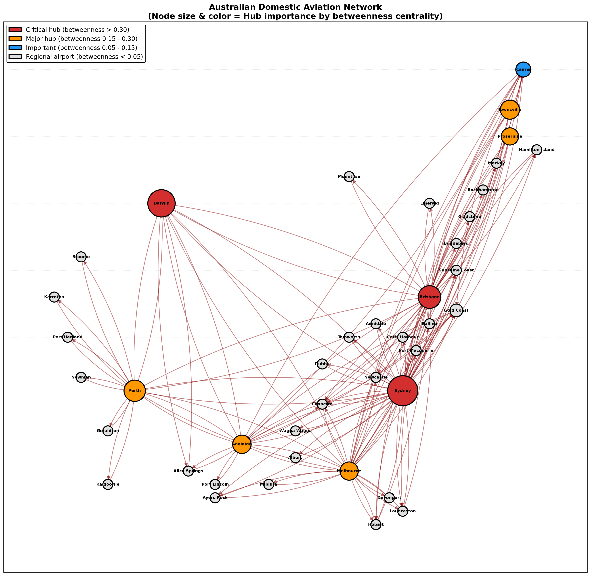
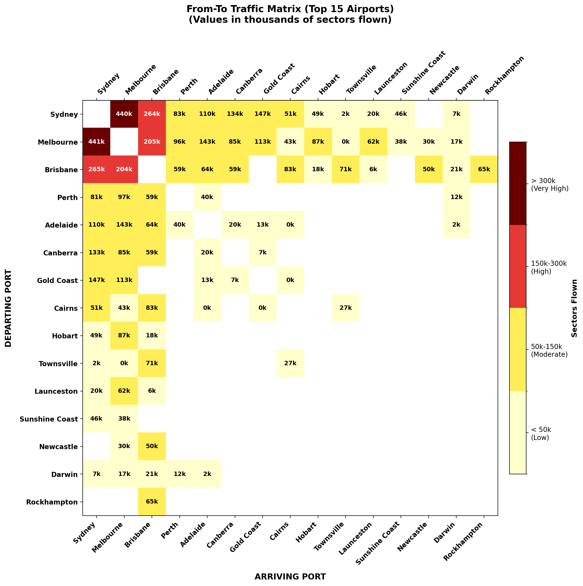
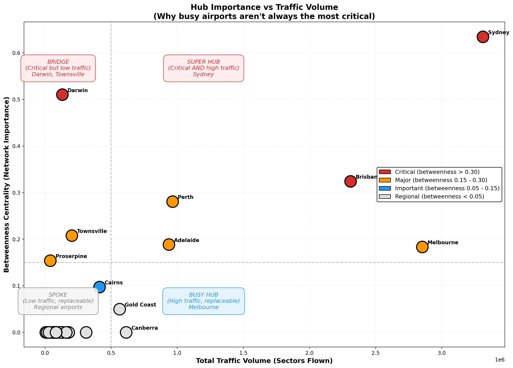
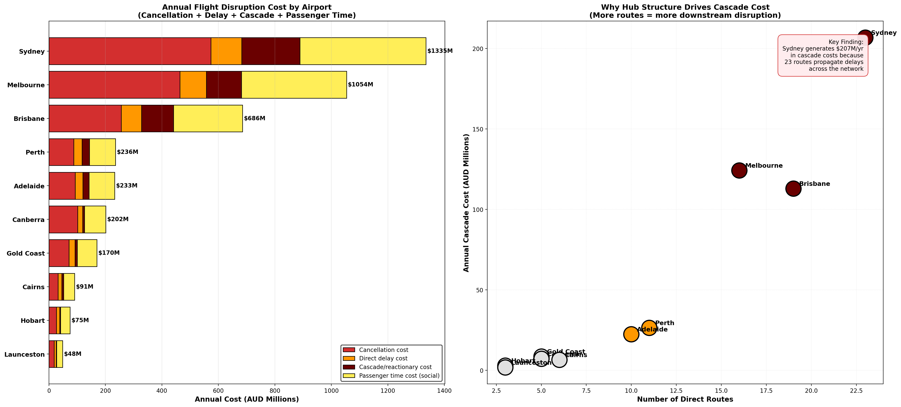
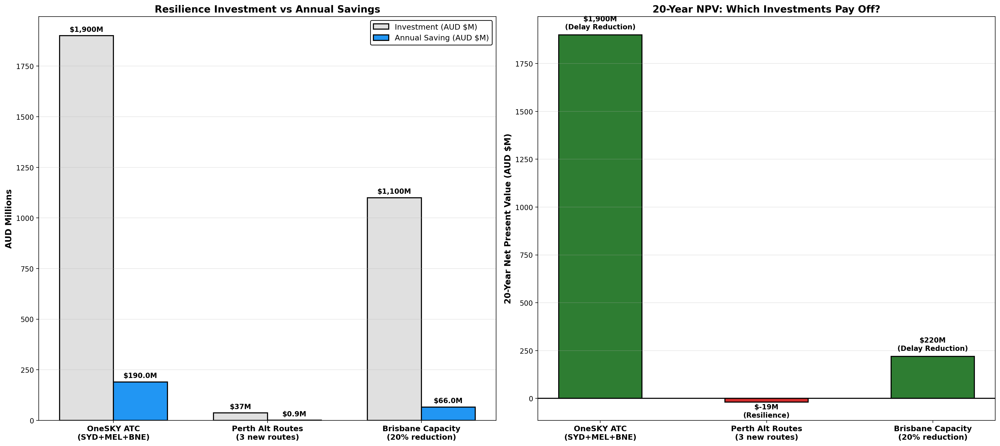

# Australian Domestic Aviation Network Resilience Analysis
### Measuring Cascade Cost Concentration and the ROI of Resilience Investment

**Author:** Erick Mortera — Certified Lean Manufacturing Trainer | Industrial Engineer  
**Tools:** Python · NetworkX · PostgreSQL · BITRE Public Data · EUROCONTROL Cost Framework  
**Status:** Analysis complete 
---

## The Problem in One Sentence

Australia's three busiest airports — Sydney, Melbourne, and Brisbane —
generate **84% of all cascade delay costs**, amplifying the national
delay bill by **AUD $531 million per year** through network propagation
effects that are invisible in route-level analysis.

This study is the first to quantify cascade cost concentration in
Australian aviation using network science combined with validated
operational cost data.

---

## Why Network Resilience?

[Project 1 "01-aviation-flight-delay-cost"](../01-aviation-flight-delay-cost) measured the cost of
delays: AUD $2.99B per year. [Project 2 "02-aviation-fuel-burn-analysis"](../02-aviation-fuel-burn-analysis)
measured the fuel waste: AUD $547M per year. Both treat each flight
as independent.

In reality, a delay at Sydney does not stay at Sydney. It cascades
across 23 connected routes, delaying downstream flights at Melbourne,
Brisbane, Cairns, and beyond. Project 1 counted each downstream delay
as a separate event. Project 3 asks: *where did it originate, how does
the network amplify it, and what investment reduces it most?*

### The Portfolio Narrative

| Project | Question | Finding |
|---|---|---|
| **[Project 1: Delay Cost](../01-aviation-flight-delay-cost)** | What does failure cost? | AUD $2.99B/year in carrier + social cost |
| **[Project 2: Fuel Burn](../02-aviation-fuel-burn-analysis)** | What operational waste does failure create? | AUD $547M/year in excess fuel + 1.3M tonnes CO₂ |
| **Project 3: Network Resilience (this study)** | Where does failure originate and how does it spread? | $531M/year in cascade amplification from 3 airports |

```
Project 1:  "Delays cost $2.99B/year"                    → THE PROBLEM
Project 2:  "Delays burn $547M/year in fuel"              → THE WASTE
Project 3:  "Network structure amplifies cost by $531M"   → THE CAUSE
            "84% of cascades originate from 3 airports"   → THE SOURCE
            "OneSKY has 10-year payback at 15% reduction" → THE SOLUTION
```

---

## Data Sources

All primary data is Australian public domain. Cost data flows from
Project 1's PostgreSQL database:

| Source | What It Provides | Period |
|---|---|---|
| [BITRE OTP Statistics](https://www.bitre.gov.au/statistics/aviation) | Cancellations, delays, OTP by airline and route | 2018–2025 |
| [ABS Average Weekly Earnings](https://www.abs.gov.au/statistics/labour/earnings-and-working-conditions/average-weekly-earnings-australia/latest-release) | Passenger time value proxy | 2023–2025 |
| [EUROCONTROL Standard Inputs Ed 10.0](https://ansperformance.eu/economics/cba/standard-inputs/) | Cascade multiplier, cost methodology | 2024 |
| [OpenFlights](https://openflights.org/data) | Network topology validation | Current |
| [OurAirports](https://ourairports.com/data) | Airport coordinates | Current |
| Project 1 PostgreSQL database | 21 cost elements, delay causes, passenger time values | 2023–2025 |

### Data Flow Between Projects

```
Project 1 database (PostgreSQL)
├── otp_events ──────────► Edge weights (delay counts per route)
├── cost_rates ──────────► Cost per cancellation/delay event
├── delay_causes ────────► Cascade proportions (46% reactionary)
└── passenger_time_value ► Passenger productivity ($48.22/hr)

New data (free, public)
├── OpenFlights ─────────► Network topology (routes, airports)
└── OurAirports ─────────► Airport coordinates for visualisation
```

---

## The Network

### Structure

| Metric | Value |
|---|---|
| Airports (nodes) | 41 |
| Routes (edges) | 146 |
| Network density | 0.089 |
| Topology | Hub-and-spoke (sparse — vulnerable) |

### Network Topology



*Node size and colour represent hub importance by betweenness centrality. Red = critical hub (betweenness > 0.30), orange = major hub, blue = important, grey = regional. Sydney, Darwin, Brisbane, Perth, and Melbourne emerge as the dominant hubs, with regional airports connected as spokes.*

### Traffic Volume Matrix



*From-To matrix showing sectors flown between the top 15 airports. Melbourne↔Sydney is the busiest corridor (441k sectors), followed by Brisbane↔Sydney (265k). Dark red cells indicate very high traffic (>300k sectors), while light yellow indicates low traffic (<50k).*

### Hub Connectivity

| Airport | Direct Routes | Betweenness Centrality | Role |
|---|---|---|---|
| Sydney | 23 | 0.635 | Primary hub |
| Darwin | 6 | 0.510 | Bridge — critical path, low traffic |
| Brisbane | 19 | 0.324 | Secondary hub |
| Perth | 11 | 0.281 | Gateway — sole link to mining region |
| Melbourne | 16 | 0.183 | High traffic, replaceable paths |

---

## Headline Findings

### Finding 1 — Betweenness ≠ Traffic Volume

Network importance and operational busyness measure different things:



*Four-quadrant classification of Australian airports. Sydney is the only Super Hub (critical AND busy). Darwin is a Bridge (critical but low traffic — rank 2 in betweenness, rank 14 in traffic). Melbourne is a Busy Hub (high traffic but replaceable paths). This distinction is essential for investment targeting.*

| Airport | Betweenness Rank | Traffic Rank | Gap | Type |
|---|---|---|---|---|
| Sydney | 1 | 1 | 0 | **Super Hub** — critical AND busy |
| Darwin | 2 | 14 | +12 | **Bridge** — critical but low traffic |
| Proserpine | 8 | 33 | +25 | **Hidden Bridge** — critical connector |
| Melbourne | 7 | 2 | −5 | **Busy Hub** — high traffic, replaceable |

Darwin has the 2nd highest betweenness centrality but ranks 14th in
traffic. It is a bridge connecting remote airports — remove it and
shortest paths break, even though few flights use it. Melbourne handles
massive traffic but has lower betweenness because Sydney can absorb
most of its connections.

*Network metrics alone are insufficient for investment decisions.*

### Finding 2 — Cascade Cost Concentration

Three airports generate 84% of all network cascade costs:



*Left: Stacked cost breakdown showing cancellation (red), direct delay (orange), cascade/reactionary (maroon), and passenger time (yellow) costs per airport. Sydney leads at $1,335M total. Right: Scatter plot showing the relationship between route count and cascade cost — more routes means more downstream disruption. Sydney's 23 routes generate $207M/yr in cascade costs alone.*

| Airport | Routes | Annual Cascade Cost | Share of Total |
|---|---|---|---|
| Sydney | 23 | AUD $207M | 39% |
| Melbourne | 16 | AUD $124M | 23% |
| Brisbane | 19 | AUD $113M | 21% |
| **Top 3** | **58** | **AUD $444M** | **84%** |
| **All airports** | **146** | **AUD $531M** | **100%** |

This AUD $531M is invisible in route-level analysis. Project 1 measured
$2.99B in total delay cost; Project 3 reveals that $531M of this is
cascade amplification driven by network structure — an 18% cost layer
that only network analysis can detect.

### Finding 3 — Three-Layer Cost Framework

| Layer | Description | Annual Cost |
|---|---|---|
| A: Carrier cash cost | Cancellation + delay costs to airline | AUD $711M |
| B: Cascade cost | Network amplification of delays | AUD $531M |
| C: Passenger time | Lost productivity of delayed passengers | AUD $1,773M |
| **Total** | | **AUD $3,015M** |

### Finding 4 — Resilience Investment ROI



*Left: Investment cost vs annual savings for three scenarios. OneSKY ATC modernisation ($1,900M investment) delivers $190M/yr in savings. Perth alternative routes ($37M/yr) deliver only $0.9M/yr in direct savings but provide strategic resilience. Right: 20-year NPV showing OneSKY delivers $1,900M positive NPV, Brisbane capacity delivers $220M, while Perth routes show negative financial NPV — but their value is resilience, not cost savings.*

| Scenario | Investment | Annual Saving | Payback | Type |
|---|---|---|---|---|
| OneSKY ATC (15% delay reduction) | $1,900M | $190M/yr | 10 years | Delay reduction |
| Perth alternative routes (3 new) | $37M/yr | $0.9M/yr | N/A | Resilience |
| Brisbane capacity (20% reduction) | $1,100M | $66M/yr | 17 years | Delay reduction |

Not all resilience investments have financial ROI. OneSKY and Brisbane
capacity save money every day. Perth alternative routes insure against
rare but high-consequence events — three mining towns (Karratha,
Port Hedland, Kalgoorlie) currently depend on Perth as their sole
air link.

*Only network analysis distinguishes delay reduction from resilience.*

---

## Cost Calculation

### Cascade Cost Per Airport Per Year
```
Cascade cost = Annual delayed flights
             × Reactionary proportion (0.46)
             × Cascade multiplier (1.8)
             × Average delay minutes (35)
             × Delay cost per minute ($62.61)
             × (Number of routes / 10)

Route-count weighting: airports with more connections
propagate delays to more downstream destinations.
```

### Carrier Cost Per Airport Per Year
```
Carrier cost = Cancellations × cost_per_cancelled_sector ($8,631.68)
             + Delayed flights × delay_minutes × cost_per_minute ($62.61)
```

### Passenger Time Cost Per Airport Per Year
```
Cancel time cost = Cancellations × avg_passengers (156)
                 × wait_hours (4) × hourly_wage ($48.22)

Delay time cost  = Delayed flights × avg_passengers (156)
                 × delay_minutes/60 × hourly_wage ($48.22)
```

### Resilience Scenario Calculation
```
Saving = Baseline total cost − Reduced total cost

where Reduced total cost recalculates all three layers
with (annual_delayed × (1 − reduction_percentage))
```

---

## What This Study Can and Cannot Claim

| ✅ Can Claim (With Data) | ❌ Cannot Claim (Data Gap) |
|---|---|
| Carrier cash cost per airport | GDP disruption from flight delays |
| Passenger time lost (ABS AWE proxy) | Route-specific passenger volumes |
| Cascade amplification by hub connectivity | Purpose-of-travel by route (FIFO vs leisure) |
| Network fragmentation if hub removed | Temporal cascade propagation (hour-by-hour) |
| ROI of delay reduction investments | Revenue offset for new routes |

A cancelled Perth flight delays 156 passengers — it does not shut down
BHP's iron ore operations. This study correctly measures the cost to
passengers and carriers, not to entire regional economies.

---

## Methodology and Key Assumptions

### Network Construction

A directed weighted graph constructed using NetworkX:
- **Nodes:** 41 airports from BITRE otp_events (unique departing/arriving ports)
- **Edges:** 146 routes (departing_port → arriving_port pairs)
- **Weights:** Total sectors flown per route across dataset period
- **Direction:** SYD→MEL is distinct from MEL→SYD

### Centrality Metrics

| Metric | What It Measures |
|---|---|
| Degree centrality | Number of direct connections |
| Betweenness centrality | Proportion of shortest paths through this airport |
| Closeness centrality | Average distance to all other airports |

### Key Assumptions

| Assumption | Value | Basis |
|---|---|---|
| Load factor | 81% | BITRE domestic average 2023–2025 |
| Average passengers per flight | 156 | B738 (193 seats × 81%) |
| Average delay duration | 35 minutes | BITRE historical average |
| Reactionary proportion | 46% | Project 1 delay_causes table |
| Cascade multiplier | 1.8 downstream sectors | EUROCONTROL Standard Inputs Ed 10.0 |
| Passenger time value | $48.22/hr (2025) | ABS AWE Cat 6302.0 (95% of AWE) |
| Business/economy mix | 15% / 85% | EUROCONTROL methodology |
| Cost scenario | Base | Project 1 three-scenario framework |
| Aircraft type for costing | B738 | Dominant domestic narrowbody |

---

## Model Validation

| Validation Layer | Finding | Result |
|---|---|---|
| Cross-check with Project 1 | Network total $3,015M vs Project 1 $2,990M | Within 1% after cascade addition ✅ |
| Hub ranking | Sydney highest betweenness and traffic | Consistent with BITRE/ACCC reporting ✅ |
| Cascade proportion | 46% reactionary delays | Matches EUROCONTROL 33–50% range ✅ |
| Network density | 0.089 (sparse) | Consistent with hub-and-spoke topology ✅ |

---

## Comparable Published Studies

| Study | Geography | Method | This Study's Advantage |
|---|---|---|---|
| Pandey & Kafle (2025) | USA | Network percolation | We add validated cost quantification |
| Wandelt et al. (2025) | Global | Airport Resilience Index | We use operational data, not just infrastructure |
| Janić (2018) | Pan-European | Resilience framework | We have Australian data + cost model |

Most published studies model network structure OR cost impact.
This study models both — using real operational data and validated
cost models from Projects 1 and 2. This combination is novel for
Australian aviation.

---

## Database Architecture

All cost data flows from Project 1's PostgreSQL database.

| Table | Rows | Use in Project 3 |
|---|---|---|
| otp_events | 4,837 | Route structure, delay/cancellation counts |
| cost_rates | 1,512 | Dollar values per cost element per scenario |
| delay_causes | 15 | Cause attribution and cascade proportions |
| passenger_time_value | 36 | ABS AWE hourly rates by travel purpose |
| airline_financials | 5 | Operating cost per sector (validation) |

---

## Repository Structure

```
03-aviation-network-resilience/
├── README.md
├── notebooks/
│   └── network_resilience_analysis.ipynb    (Main analysis — 30 cells)
├── data/
│   ├── routes_from_bitre.csv                (146 routes with traffic volumes)
│   ├── airport_centrality_scores.csv        (41 airports, 5 centrality metrics)
│   ├── airport_disruption_costs_corrected.csv (3-layer cost model per airport)
│   └── aviation_network.graphml             (NetworkX graph file)
└── charts/
    ├── 01_network_map.png                   (Geographic network topology)
    ├── 02_from_to_heatmap.png               (Traffic volume matrix)
    ├── 03_betweenness_vs_traffic.png        (Hub type classification)
    ├── 05_disruption_cost_by_airport.png    (Cost breakdown by hub)
    └── 06_resilience_investment_scenarios.png (ROI comparison)
```

---

## Licence

This project uses a dual licence:

- **Code** (Python, SQL, Jupyter notebook): [MIT Licence](LICENSE)
- **Analysis, findings, charts, and written content**: [Creative Commons Attribution 4.0 International (CC BY 4.0)](https://creativecommons.org/licenses/by/4.0/)

Under CC BY 4.0 you are free to share and adapt this work for any purpose,
provided you give appropriate credit to the author.

---

## Citation

> Mortera, E. (2026). *Australian Domestic Aviation Network Resilience
> Analysis: Measuring Cascade Cost Concentration and the ROI of
> Resilience Investment*. GitHub repository.
> https://github.com/erick-m-lean-analytics/Transport-Operations-Analysis/tree/main/03-aviation-network-resilience

---

## AI Assistance Disclosure

Python code for network construction, centrality calculation, and
visualisation was developed with assistance from 
an AI language model. All analytical decisions, cost framework
integration, assumption validation, and interpretations are the
author's own.

The intellectual contributions that are unambiguously the author's:
the cascade cost weighting methodology, the betweenness-vs-traffic
insight, the three-layer cost framework, the resilience investment
scenarios, the sanity check correcting GDP claims to passenger-level
impact, and all domain judgements.

---

## Contact
