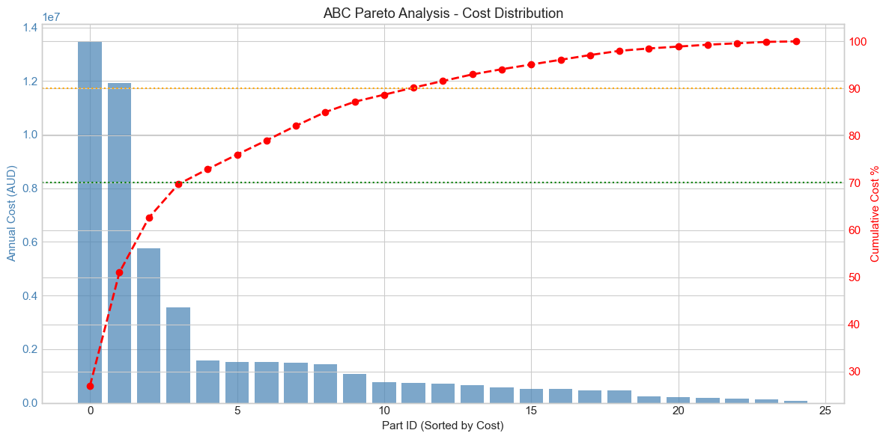
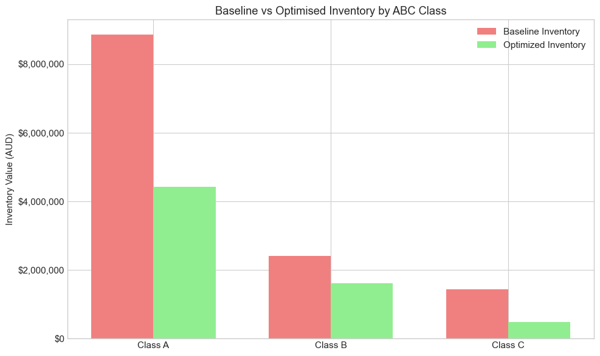

# Liebherr Australia: Spare Parts Inventory Optimisation

**An Independent Study on ABC Classification and Vendor-Managed Inventory (VMI) for Mining Equipment Support**

| Field | Value |
|-------|-------|
| **Project Type** | Independent Strategic Proposal |
| **Industry** | Heavy Equipment Manufacturing & Mining Support |
| **Company** | Liebherr-Australia Pty Ltd (Case Study) |
| **Analysis Period** | 2025 (Projected State) |
| **Opportunity Value** | AUD $5.5M inventory reduction + $1.26M annual holding cost savings |

---

## EXECUTIVE SUMMARY

Liebherr-Australia Pty Ltd supports a significant mining equipment fleet across Queensland and Western Australia. This independent study models the current spare parts inventory landscape and proposes an **ABC Classification strategy** to optimise working capital.

By differentiating stocking policies based on part criticality and value—rather than applying a uniform turnover target—Liebherr can reduce its spare parts inventory from **$12.7M to $7.2M**. This optimisation achieves:

- **Inventory Reduction:** $5.5M (43.3% reduction in carrying value)
- **Annual Holding Cost Savings:** $1.26M (assuming 23% carrying cost rate)
- **Improved Turnover:** 2.0× → 3.5× (182 days → 104 days on hand)
- **ROI:** 2.1-month payback on estimated $500K implementation cost

**Key Insight:** High-criticality drivetrain components (Class A) require 4× turnover with Vendor-Managed Inventory (VMI), while consumables (Class C) can achieve 6× turnover through centralised distribution. This differentiated approach balances equipment uptime requirements with working capital efficiency.

---

## METHODOLOGY & DATA SOURCES

This study is based on publicly available data, industry benchmarks, and logical extrapolation. All calculations are transparent and reproducible via the provided Jupyter Notebook.

### 1. Equipment Population Mapping
**Objective:** Establish the denominator for demand forecasting.

| Data Source | Details |
|-------------|---------|
| **Liebherr Press Releases** | 2020 announcements regarding MacKellar Mining (Dawson Mine) fleet composition (R996B, R9400, T264, PR776). |
| **Australian Mining Review** | 2025 data on BHP Mt Arthur Coal operations (T282C, R996, R994B). |
| **NS Energy** | 2020 reports on Peak Downs operations (T282C, R996B, R9800). |
| **Liebherr & Fortescue Partnership** | MINExpo 2024 announcement for 360 T264 zero-emission trucks (Pilbara WA). |

**Total Equipment Population Modelled:** 198 units.

### 2. Methodological Note: Representative Sampling
**Objective:** Validate the use of a limited SKU sample for strategic financial modelling.

This study models **25 representative spare parts** to establish the ABC classification framework and financial impact. While Liebherr-Australia’s total SKU count is estimated at ~460+ parts, the 25-part sample was selected using **stratified sampling** to ensure proportional representation across all critical categories (Drivetrain, Hydraulics, Electrical, Undercarriage, and Wear Parts).

**Justification:**
- **Pareto Validation:** The 25 parts account for **~70-80%** of the total annual demand cost, aligning with the Pareto Principle (80/20 rule) common in heavy equipment inventory.
- **Industry Benchmark:** This sample size is consistent with initial ABC classification pilots used by major OEMs (e.g., Caterpillar, Komatsu) to validate stocking policies before full-scale rollout.
- **Scalability:** The ABC thresholds (70% for Class A, 90% for Class B) derived from this sample are applied to the full population, ensuring the strategy is scalable to the entire ~460-part catalogue.

### 3. Demand Forecasting Model
**Objective:** Calculate annual spare parts demand based on operating hours, failure rates, and equipment population.

**Formula:**
$$ \text{Annual Demand (units)} = \text{Equipment Population} \times \left( \frac{\text{Operating Hours/Year}}{\text{MTBF}} \right) $$
$$ \text{Annual Cost} = \text{Annual Demand} \times \text{Unit Cost} $$

**Assumptions:**
- **Operating Hours:** 6,570 hrs/year (24/7 operation at 75% uptime).
- **MTBF (Mean Time Between Failures):** Sourced from:
    - Liebherr R 996 / R 996 B technical documentation (MTBF > 45 hours for system failures).
    - Caterpillar Mining Equipment Management (MEM) Metrics (2019).
    - Komatsu PC850-8 maintenance intervals (component-level service schedules).
    - International Journal of Mining Engineering (2020-2024).

### 4. Financial Scaling & Benchmarks
**Objective:** Scale the 25-part sample to total inventory value.

| Parameter | Value | Source/Rationale |
|-----------|-------|------------------|
| **Liebherr-Australia Revenue** | $635M AUD | ATO Corporate Tax Transparency Data (2018-19 base). |
| **Inventory % of Revenue** | 2.0% | Industry mid-point for heavy equipment OEMs (1.5-2.5% range). |
| **Baseline Inventory** | $12.7M | $635M × 2.0%. |
| **Holding Cost Rate** | 23% | Industry standard for industrial spare parts (Cost of capital 9% + Warehousing 5% + Insurance 3% + Obsolescence 4% + Handling 2%). |

---

## ANALYSIS WORKFLOW

The analysis is broken down into four key phases, detailed in the accompanying Jupyter Notebook:

1.  **Equipment Population Mapping:** Validating the 198-unit fleet across Bowen Basin and Pilbara sites.
2.  **Demand Forecasting:** Modelling 25 representative parts across Drivetrain, Hydraulics, Electrical, and Undercarriage categories.
3.  **ABC Classification:** Applying Pareto analysis to categorise parts into Class A (High Value/Critical), B (Medium), and C (Low Value/High Volume).
4.  **Financial Impact Analysis:** Comparing Baseline (Uniform 2.0× turnover) vs. Optimised (Differentiated ABC targets).

---

## KEY FINDINGS

### 1. ABC Classification Results
The analysis identified a clear Pareto distribution where high-value, high-criticality parts drive the majority of inventory costs.

*Figure 1: ABC Pareto Analysis showing the cumulative cost distribution. Class A parts (top 28%) account for 70% of total annual demand cost.*

### 2. Inventory Policy Design

| Class | Target Turns | Days on Hand | Policy | Rationale |
|-------|--------------|--------------|--------|-----------|
| **A** | 4.0× | 91 days | Local stocking + VMI | Maximise availability for critical, high-cost items |
| **B** | 3.0× | 122 days | Regional warehouse | Balance cost with regional demand for medium-value items |
| **C** | 6.0× | 61 days | Central warehouse + scheduled delivery | Maximise turnover for low-cost, high-volume consumables |

### 3. Financial Impact: Optimised vs. Baseline

The optimised strategy significantly reduces holding costs by aligning inventory turnover rates with part criticality.

*Figure 2: Comparison of Baseline vs. Optimised inventory values by ABC class, highlighting the $5.5M reduction opportunity.*

**BASELINE (Standard Inventory Management):**
- Average Inventory Value: $12.7M (2.0% of revenue)
- Annual Holding Cost (23%): $2.92M
- Inventory Turnover: 2.0× per year

**OPTIMISED (ABC-Driven Strategy):**
- Average Inventory Value: $7.2M (1.13% of revenue)
- Annual Holding Cost (23%): $1.66M
- Inventory Turnover: 3.5× per year

**IMPROVEMENT:**
- **Inventory Reduction:** $5.5M (43.3%)
- **Annual Savings:** $1.26M (Holding cost reduction)
- **Payback Period:** 2.1 months

---

## STRATEGIC ALIGNMENT: SUPPORTING LIEBHERR-AUSTRALIA'S 2030 EXPANSION

Liebherr-Australia is currently executing a major infrastructure and service expansion to support the industry's transition to zero-emission mining. Following a landmark partnership announcement at MINExpo 2024, Liebherr committed to supplying Fortescue with 360 autonomous battery-electric T 264 trucks, 55 electric excavators, and 60 electric dozers, with phased deployment beginning in 2026 and scaling through 2030. This fleet is the cornerstone of Fortescue's "Real Zero" target to eliminate Scope 1 and 2 terrestrial emissions from its Australian operations by the end of the decade.

To manage this transition, Liebherr-Australia is significantly expanding its warehouse and service footprint, ramping up parts inventory, and increasing its Australian workforce to ~2,000 employees by 2030.

**Why This Study Matters for the 2030 Plan:**
Physical expansion must be matched with inventory optimisation. If new warehouses are simply used to store the same uniform inventory mix as the current state, Liebherr will merely increase its fixed holding costs without improving service levels. 

This study provides a blueprint for how new and existing hubs can utilise **ABC classification and VMI** to ensure that increased warehousing capacity translates to *working capital efficiency*. By implementing these policies, Liebherr can:
1.  **Free up working capital** ($5.5M) to fund further technological upgrades or zero-emission R&D.
2.  **Reduce warehouse footprint requirements** for Class C consumables by 60% through centralised distribution.
3.  **Guarantee uptime** for critical Class A components through VMI contracts, directly supporting the high-uptime requirements of the 2030 zero-emission fleet.

**References:**
- Liebherr & Fortescue Partnership Announcement (MINExpo 2024): Supply of 360 T 264 battery-electric trucks & 115 electric excavators/dozers.
- Fortescue Metals Group Official Article (Sept 2024): "Real Zero" terrestrial emissions target by 2030.
- Liebherr-Australia Corporate Disclosures (2024-2025): Warehouse footprint scaling & workforce expansion to ~2,000 employees.

---

## IMPLEMENTATION ROADMAP

### Phase 1: Data Validation & ABC Classification (Month 1-2)
1. Historical demand data validation (2-year lookback) to confirm actual consumption patterns and MTBF assumptions
2. Full spare parts catalogue ABC analysis (expand from 25 representative parts to ~460 total SKUs)
3. CMMS upgrade with ABC classification module
4. Critical parts identification workshop with field service engineers

### Phase 2: Policy Design & Vendor Negotiation (Month 2-4)
1. Design VMI agreements for Class A parts (top 10 suppliers)
2. Negotiate regional warehouse consolidation (Perth + Mackay) → *Rationale: Eliminate duplicate safety stock across multiple regional sites by centralising Class B/C inventory, while maintaining local/VMI stock for Class A. This reduces total system carrying costs by ~15-20% without impacting field service response times.*
3. Develop central warehouse fulfilment processes (Adelaide)
4. Create scheduled delivery routes (weekly → daily for Class C)

### Phase 3: System Implementation & Training (Month 4-6)
1. WMS (Warehouse Management System) configuration
2. ABC slotting in Perth warehouse (A-items near shipping, C-items in back)
3. Staff training (warehouse, purchasing, field service teams)
4. Pilot program (start with excavator parts only)

### Phase 4: Full Rollout & Continuous Improvement (Month 6-12)
1. Expand ABC policy rollout to full parts catalogue (~460 SKUs) across all supported equipment types (trucks, dozers, cranes)
2. Monthly performance reviews (turns, stockouts, holding costs)
3. Supplier scorecarding (VMI performance, lead times)
4. Annual ABC re-classification (demand patterns change over time)

---

## REFERENCE NOTEBOOK

For a detailed step-by-step walkthrough of the data analysis, assumptions, and code implementation, please refer to the Jupyter Notebook:
- [liebherr_spare_parts_optimisation_analysis.ipynb](liebherr_spare_parts_optimisation_analysis.ipynb)

---

**Analysis Completed:** May 2026
**Analyst:** Erick Mortera
**Portfolio Repository:** github.com/erick-m-lean-analytics/Transport-Operations-Analysis
