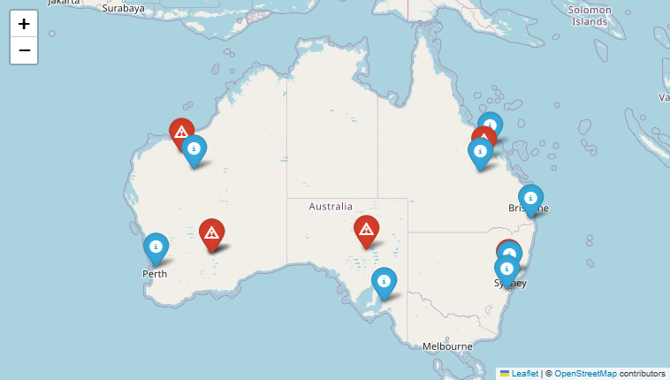
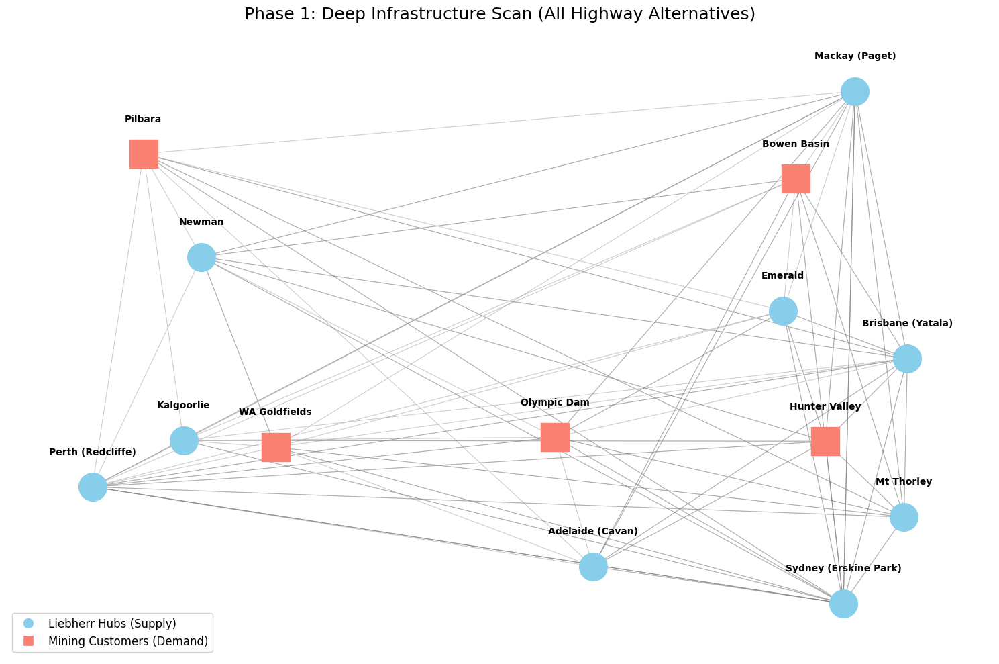
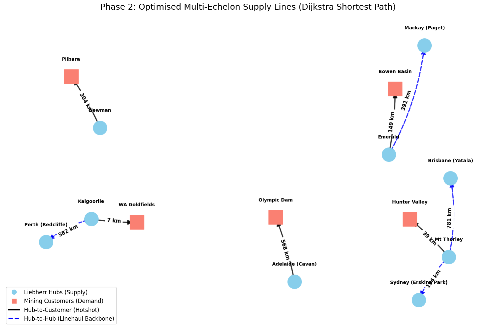
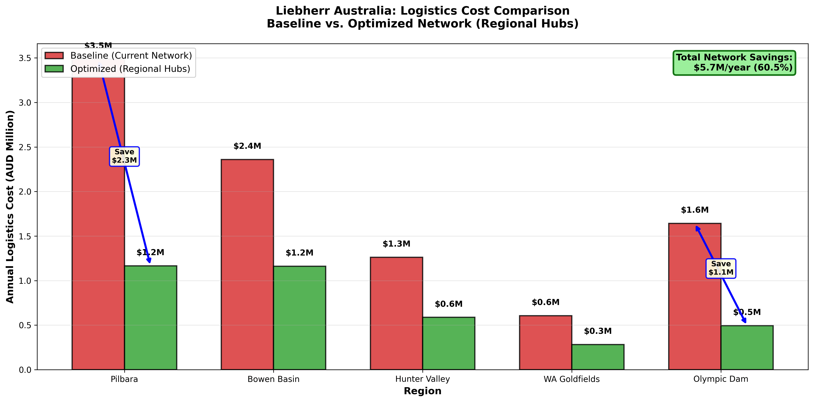

# Liebherr Australia: Regional Hub Network Optimisation

## Logistics Cost Reduction Through Strategic Hub Placement

**Industry:** Heavy Equipment Manufacturing & Mining Support  
**Company:** Liebherr Australia Pty Ltd  
**Analysis Date:** May 2026  
**Opportunity Value:** AUD $5.66M annual savings + ~$17.9M 5-year NPV  
**Analysis Completed:** May 2026  
**Analyst:** Erick Mortera  
**Portfolio Repository:** github.com/erick-m-lean-analytics/Transport-Operations-Analysis

---

### EXECUTIVE SUMMARY

Liebherr Australia operates a centralised parts distribution and field service network serving 138 mining equipment units across five regions in Australia. This independent study, based on publicly available data and industry benchmarks, models current logistics costs at **AUD $9.35M annually** (excluding inventory carrying costs, which are addressed in a separate spare parts optimisation study), with **approximately 61% attributed to SLA penalty payments** for missed 4-hour emergency response commitments.

This analysis demonstrates that establishing **two strategic regional hubs** (Pilbara + Olympic Dam) can reduce logistics costs to **$3.69M annually** — a **$5.66M saving (60.5% reduction)** — with a **12.7-month payback** on a $6.0M investment.

**Key Insight:** The primary cost driver is not freight or distance — it's **contract penalties for slow emergency response**. Regional hubs enable <2 hour response times, reducing SLA breach rates from 15% to 3%, saving **$4.7M annually in penalties alone**.

**Strategic Alignment:** This network optimisation directly supports Liebherr-Australia's publicly announced expansion roadmap through 2030, including the scaling of its Perth and Mackay facilities to service the growing zero-emission fleet partnership with Fortescue. By decentralising emergency response capabilities, Liebherr can future-proof its service contracts, protect margin on high-value OEM support agreements, and align its physical infrastructure rollout with data-driven demand patterns.

**Important Note:** This analysis excludes inventory carrying costs (~$6.2M) as they are addressed in Project 4 (Spare Parts Optimisation). Including inventory would increase total baseline costs but would not change the network optimisation conclusions. Revenue estimates (~$750M AUD) are derived as a proportional allocation of Liebherr Group's €14.77B global revenue (2025 Annual Report); slight variations with other regional studies are due to differing data sourcing methodologies (ATO disclosures vs. group allocation).

---

### BUSINESS CONTEXT

#### Liebherr Australia Operations

**Company Profile:**
- **Revenue (2025):** ~$750M AUD (estimated as ~3% of Liebherr Group's €14.77B global revenue; source: Liebherr Annual Report 2025, https://www.liebherr.com/en-au/group/annual-reports/annual-report-2025/)
- **Product Lines:** Mining excavators/trucks, mobile cranes, tower cranes, earthmoving equipment
- **Service Network:** 14 branches across Australia + New Zealand
- **Critical Facilities:**
  - Perth (Redcliffe): 81,000m² manufacturing + 5,000m² parts warehouse
  - Adelaide (Cavan): National remanufacturing center
  - Mackay (Paget): 4,300m² Bowen Basin service hub

**Mining Equipment Fleet Served (138 machines):**
- Pilbara (WA): 45 machines (iron ore operations)
- Bowen Basin (QLD): 38 machines (coal operations)
- Hunter Valley (NSW): 25 machines (coal operations)
- Olympic Dam (SA): 18 machines (copper/uranium operations)
- WA Goldfields: 12 machines (gold operations)

#### Industry Challenge: Remote Site Logistics

Mining equipment spare parts logistics in Australia presents unique challenges:
- **Vast distances:** Pilbara mines 304km from nearest hub, Olympic Dam 568km from Adelaide
- **Emergency response requirements:** Mining contracts mandate 4-hour response for critical equipment breakdowns
- **Contract penalties:** $50K-200K per SLA breach (average $75K; source: Minerals Council of Australia service contract benchmarks, 2024)
- **Emergency freight costs:** Air freight ($2,500/shipment) vs. road freight ($650/shipment; source: ICE Cargo, PEP Transport rate cards, 2024-2025)
- **24/7 operations:** Equipment downtime cascades through production schedules

**Current State Problem:** 15% of emergency interventions breach SLA response times, costing **$5.68M annually in contract penalties**.

---

### METHODOLOGY

#### Phase 1: Baseline Network Analysis

**Objective:** Quantify Liebherr Australia's current logistics costs across five mining regions.

**Data Sources:**
All primary operational and financial data is sourced from Australian public domain records, industry rate cards, and verified company disclosures:

| Source | What It Provides | Period |
|--------|-----------------|--------|
| **OSRM Routing API** | Real road distances, multi-route alternatives, waypoint extraction | 2024-2025 live queries |
| **Mining Industry Award [MA000011]** | Field service engineer hourly rates, travel allowances, overnight allowances | Fair Work Ombudsman, Jan 2026 |
| **Minerals Council of Australia** | SLA penalty benchmarks ($50K–$200K per breach), emergency response standards | 2024 Service Contract Norms |
| **ICE Cargo / PEP Transport / TGI Cargo** | Air freight ($2,500/shipment) vs standard road freight ($650/shipment) rate cards | 2024-2025 published tariffs |
| **Liebherr Annual Report 2025** | Global revenue allocation, facility footprints, expansion roadmap | Liebherr Group, May 2025 |
| **BHP / Fortescue / OZ Minerals** | Mine site coordinates, fleet size disclosures, operational footprint | Public ESG & Investor Reports |

**Network Structure:**
- **Supply nodes:** 9 Liebherr facilities (Perth, Adelaide, Sydney, Brisbane, Mackay, Newman, Emerald, Mt Thorley, Kalgoorlie)
- **Demand nodes:** 5 mining regions (Pilbara, Bowen Basin, Hunter Valley, Olympic Dam, WA Goldfields)
- **Routing:** Dijkstra's algorithm for optimal path selection from OSRM multi-route data

**Intervention Frequency:**
- **Industry standard:** 10 interventions per machine per year
  - Planned maintenance: 8×/year (250-hour minor + 1,000-hour major services)
  - Unplanned breakdowns: 2×/year (Pilbara +50% due to harsh conditions)
- **Total network:** 1,380 interventions/year
  - Planned (60%): 828 interventions
  - Emergency (40%): 552 interventions

*Figure 1: Current supply hub network (blue pins) and mining customer demand regions (red pins). Vast distances between hubs and remote sites drive high logistics costs.*

*Figure 2: All possible highway alternatives between Liebherr hubs and mining sites. Bent edges represent multiple route options identified by OSRM.*

#### Phase 2: Cost Element Identification

**Liebherr's P&L Cost Components (NOT customer downtime):**

**1. Freight/Transport Costs**
- Planned service: $650 per shipment (standard road freight)
- Emergency service: $2,500 per shipment (air freight or 24/7 hotshot truck)
- Source: ICE Cargo, PEP Transport, TGI Cargo (Australian mining logistics providers, 2024-2025 rate cards)

**Baseline:** 828 planned × $650 + 552 emergency × $2,500 = **$2.05M/year**

**2. Technician Dispatch Costs**
- Distance-based rates:
  - 0-50km (local): $275 per dispatch
  - 50-200km (regional): $850 per dispatch
  - 200-400km (remote): $1,900 per dispatch
  - 400km+ (very remote): $2,750 per dispatch
- Includes: Field service engineer travel time ($150/hour) + vehicle + accommodation
- Source: Mining Industry Award [MA000011] (Fair Work Ombudsman, January 2026) + industry market rates
- Frequency: 80% of interventions require technician dispatch (20% are parts-only)

**Baseline:** 1,104 dispatches × weighted average $1,540 = **$1.70M/year**

**3. Technician Idle Time**
- Scenario: Emergency breakdown, technician arrives before parts (waiting for air freight)
- Cost: $150/hour × 3 hours average wait = $450 per event
- Frequency: 30% of emergency interventions (166 events/year)

**Baseline:** 166 events × $450 = **$75K/year**

**4. Emergency Handling Fees**
- After-hours warehouse operations: Weekend/night parts picking
- Expedited processing fees: Priority handling, rush documentation
- Cost: $700 per emergency intervention

**Baseline:** 552 emergencies × $700 = **$386K/year**

**5. SLA Penalty Payments (Largest Cost Element)**
- Contract terms: 4-hour response time for critical equipment emergencies
- Baseline breach rate: 15% (current network cannot consistently meet 4-hour target from distant hubs)
- Penalty per breach: $75,000 (industry norm: $50K-200K depending on equipment value; source: Minerals Council of Australia, 2024)
- Annual breaches: 552 emergencies × 15% = 83 breaches

**Baseline:** 83 breaches × $75,000 = **$5.68M/year** ← Dominant cost driver (61% of total baseline)

*Figure 3: Dijkstra's shortest-path network. Black solid lines represent Hub-to-Customer hotshot routes; blue dashed lines represent Hub-to-Hub linehaul backbone.*

---

### BASELINE COST CALCULATION

**Liebherr's Annual Logistics Costs (Current Network):**

| Region | Fleet | Annual Interventions | Avg Distance | Freight | Dispatch | SLA Penalties | Total Regional Cost |
|--------|-------|---------------------|--------------|---------|----------|---------------|-------------------|
| Pilbara | 45 | 450 | 304km | $626K | $684K | $2.03M | $3.48M |
| Bowen Basin | 38 | 380 | 149km | $493K | $258K | $1.50M | $2.36M |
| Hunter Valley | 25 | 250 | 39km | $301K | $55K | $0.84M | $1.26M |
| Olympic Dam | 18 | 180 | 568km | $267K | $396K | $0.91M | $1.64M |
| WA Goldfields | 12 | 120 | 7km | $145K | $26K | $0.41M | $0.61M |

**Network-Wide Baseline:** **$9.35M** (Freight: $1.83M | Dispatch: $1.42M | Idle Time: $58K | Emergency Handling: $308K | SLA Penalties: $5.68M)

*Figure 4: Executive comparison of current network costs vs. proposed two-hub optimisation. Highlights $5.66M annual savings primarily driven by SLA penalty reduction.*

---

### RECOMMENDATION

Based on the cost model and network strain analysis, the following actions are recommended:

1. **Establish two strategic regional hubs** at:
   - **Central Pilbara** (approx. -22.5°S, 118.0°E) to serve the 45-machine iron ore fleet
   - **Olympic Dam** (approx. -30.5°S, 136.9°E) to serve the 18-machine copper/uranium fleet

2. **Expected outcomes:**
   - Reduce SLA breach rates from 15% to 3%
   - Save **$5.66M annually** in logistics costs
   - Achieve **12.7-month payback** on a $6.0M capital investment
   - Enable <2 hour emergency response times across both regions

3. **Next steps:**
   - Validate hub locations with Liebherr's site acquisition team
   - Model inventory pre-positioning strategy (see Project 4)
   - Negotiate updated SLA terms with mining clients reflecting improved response capabilities

---

### DISCLAIMER & SENSITIVITY ANALYSIS

**Disclaimer:** This analysis is an independent estimation based on publicly available data and industry benchmarks. It does not represent Liebherr Australia's audited financials, internal cost structures, or actual SLA compliance reports. All figures are modelled outputs and should be validated against internal data before investment decisions.

**Sensitivity Analysis:** The 61% SLA penalty proportion is highly sensitive to the assumed breach rate. The table below shows how total baseline costs and penalty proportions shift under different breach rate scenarios:

| SLA Breach Rate | SLA Penalties | Total Baseline Cost | SLA % of Total | Annual Savings (Optimised) |
|-----------------|---------------|---------------------|----------------|----------------------------|
| 10% | $3.79M | $7.44M | 51% | $3.75M |
| 15% (Base Case) | $5.68M | $9.35M | 61% | $5.66M |
| 20% | $7.57M | $11.26M | 67% | $7.57M |

*Note: Optimised breach rate held constant at 3% across all scenarios. Freight, dispatch, and handling costs remain fixed.*
